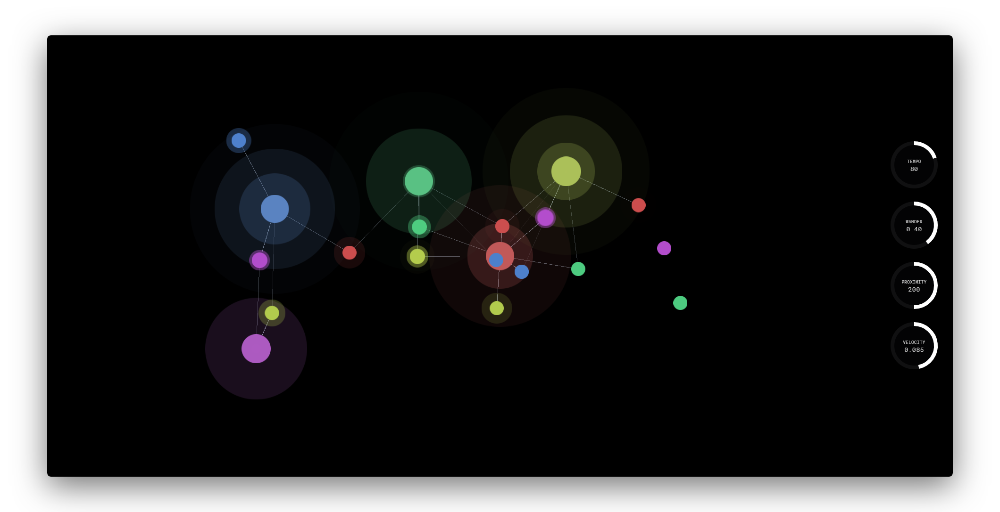

NodeSynth
==========

Demo
----

About
-----

This sequencer is based around physical nodes, which connect to produce a variety of tones. There are two types of node, a neuron and a receptor, which are connected by synapses. Neurons fire periodically, and if within a certain proximity of a receptor, this message is sent at a fixed speed along the bridging synapse. When the message arrives, the receptor is activated and responds by queuing it's individual tone within the audio engine. Each receptor owns a randomly assigned note, and each neuron a randomly assigned octave; therefore a receptor will play it's note in several different octaves depending on which neuron causes it to fire.